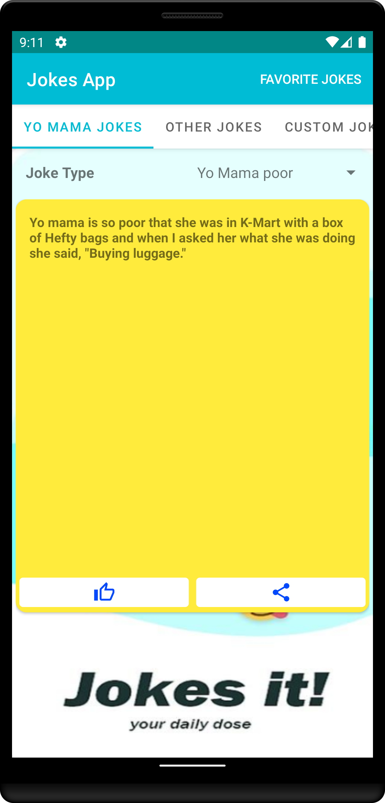
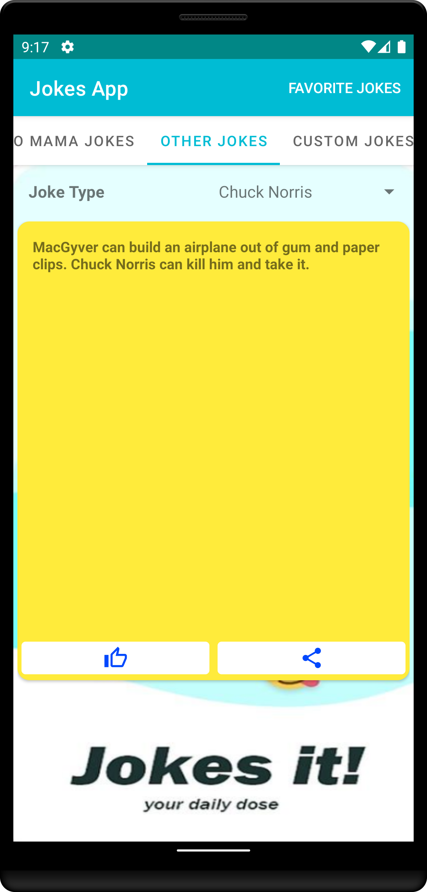
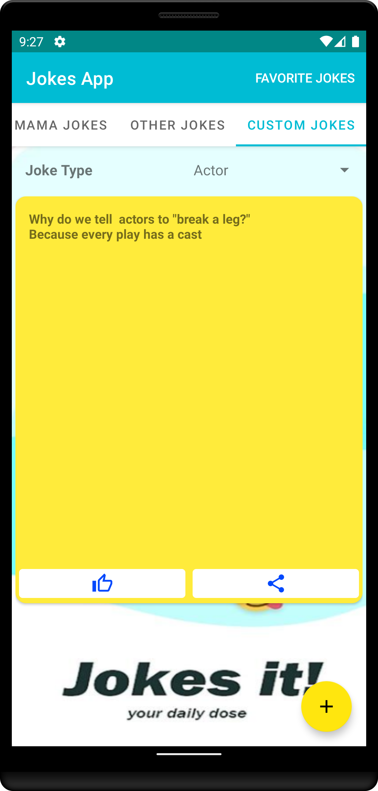
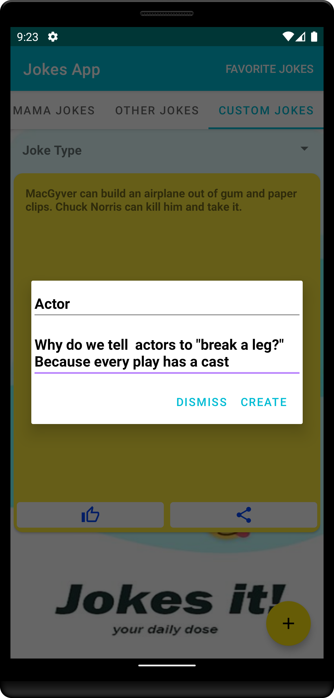
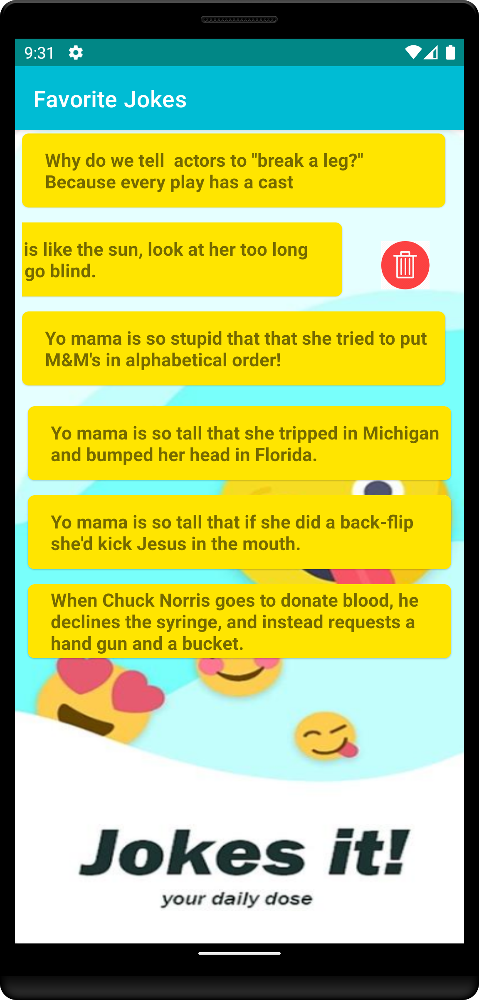
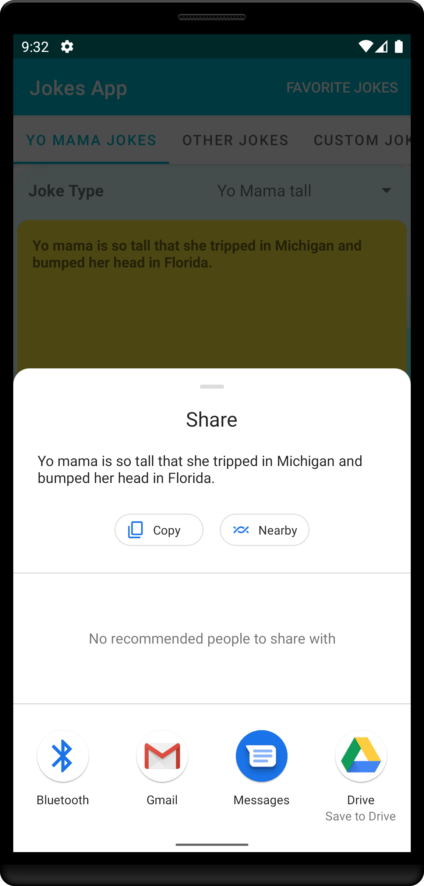

# JokesApp

## Description

JokesApp is an sample jokes application which follows MVC architecture. The sample application shows jokes from yoMama and Chuck Norris categories. The user can also add custom joke. 
The user can also add any joke to favorite category. It uses volley library to fetch jokes from local json file.

## Application Screenshots 

* Yo Mama Jokes Screen: It shows jokes from yo mama category.
   

   
   

   
* Chuck Norris Jokes Screen: It shows jokes from chuck norris category.
   

   
   

   
* Custom Jokes Screen: It shows jokes which are added manually.
   

   
   

   
* Add Custom Joke Screen: It shows how to add custom joke.
   

   
   

   
* Favorite Jokes Screen: It shows jokes which are added to favorite category.
   

   
   

   
* Share Joke Screen: It shows sharing joke screen.
  -

   
   

